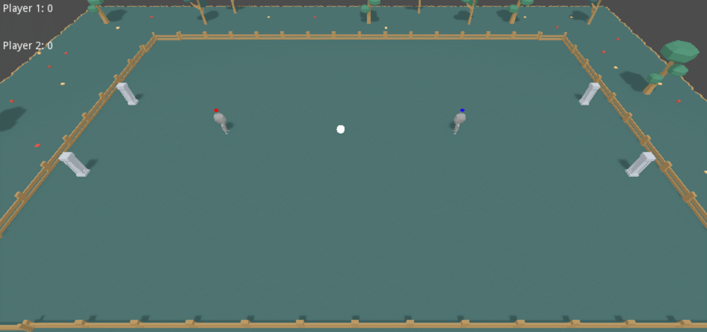

# GodotBasic3DFootball
A very basic 3D football/soccer game as a study on the godot game engine 

## Third party assets used:
* **Enviroment Models(Nature Pack) :** http://kenney.nl/
* **Character Model :** https://www.patreon.com/posts/blender-to-godot-16980501

## Controls
- <kbd>R</kbd>: Reset Positions
- <kbd>N</kbd>: New Game

### Player 1
- <kbd>↑/←/↓/→</kbd>: Move 
- <kbd>TAB</kbd>: Jump
### Player 2
- <kbd>W/A/S/D</kbd>: Move
- <kbd>TAB</kbd>: Jump

